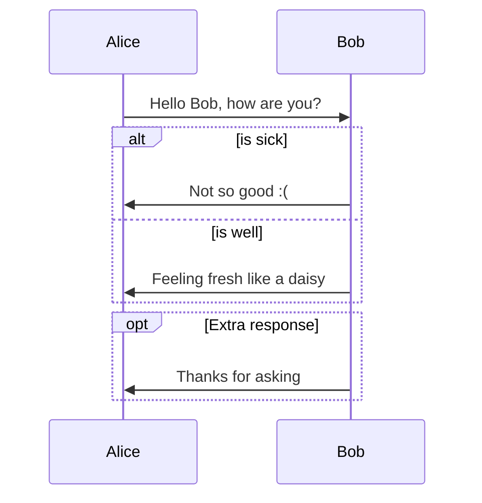
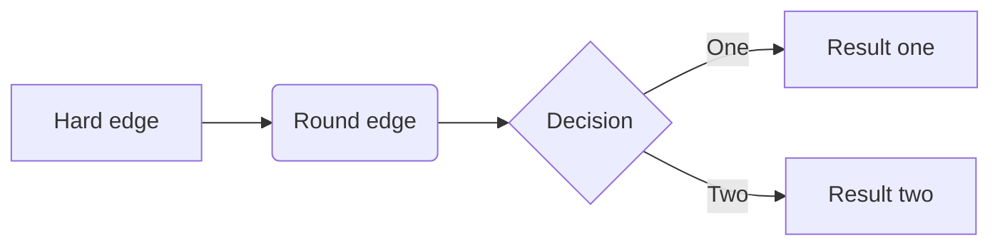
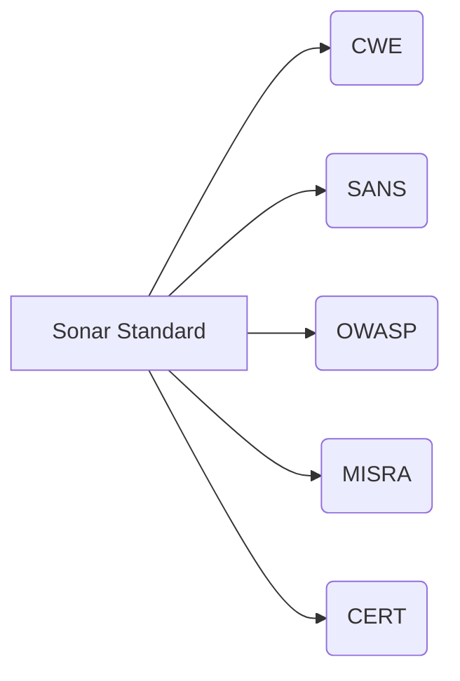
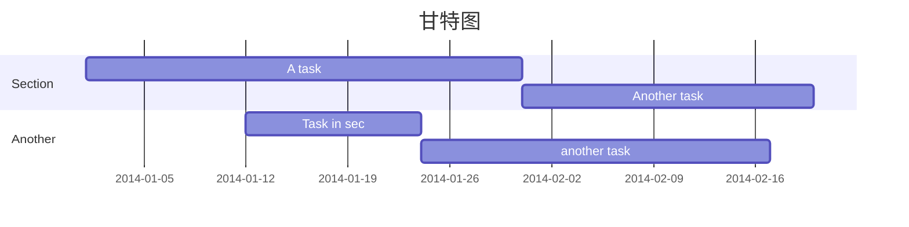
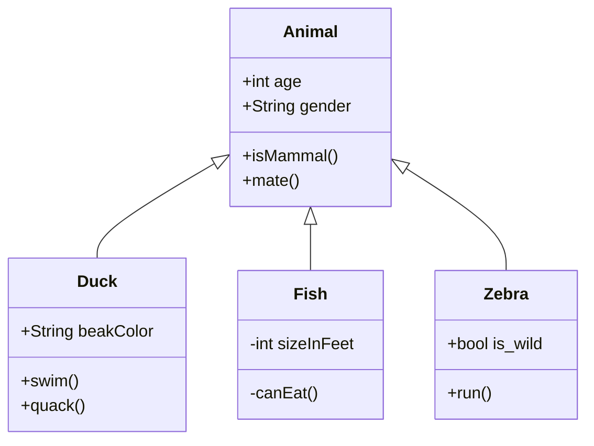
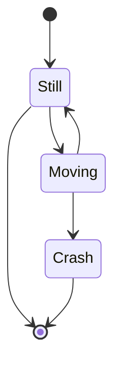
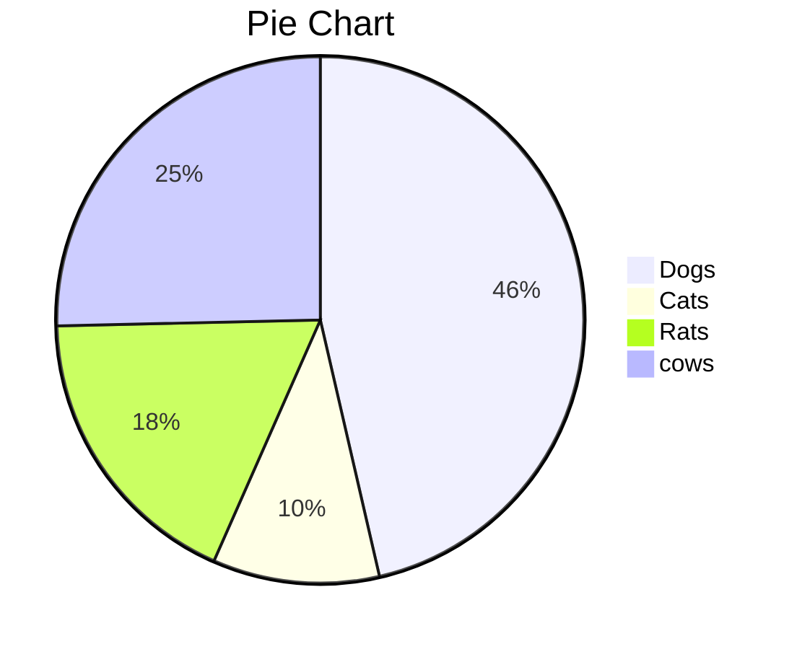
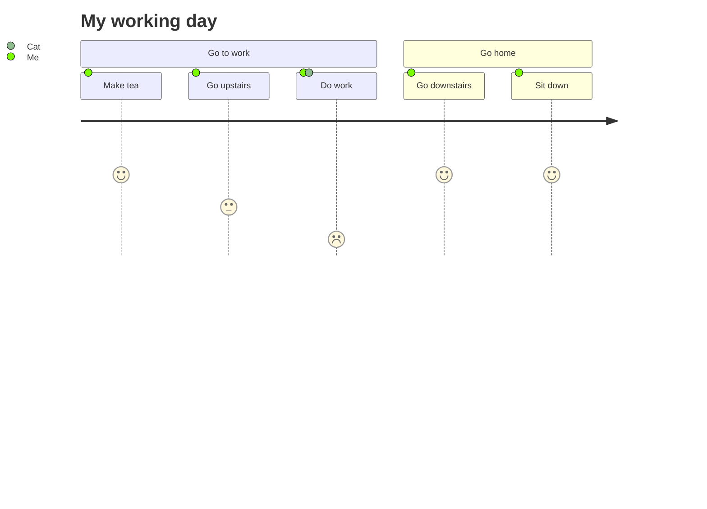

### 参考文档
* [Draw Diagrams With Markdown](https://support.typora.io/Draw-Diagrams-With-Markdown/)

### 图形分类
#### 时序图
##### 方式一

~~~gfm
```sequence
Alice->Bob: Hello Bob, how are you?
Note right of Bob: Bob thinks
Bob-->Alice: I am good thanks!
```
~~~

```sequence
Alice->Bob: Hello Bob, how are you?
Note right of Bob: Bob thinks
Bob-->Alice: I am good thanks!
```

##### 方式二

~~~gfm

~~~


#### 流程图
##### 方式一

~~~gfm
```flow
st=>start: Start
op=>operation: Your Operation
cond=>condition: Yes or No?
e=>end

st->op->cond
cond(yes)->e
cond(no)->op
```
~~~

```flow
st=>start: Start
op=>operation: Your Operation
cond=>condition: Yes or No?
e=>end

st(right)->op(right)->cond
cond(yes)->e
cond(no)->op
```

##### 方式二

~~~gfm

~~~


~~~gfm

~~~


#### [甘特图](https://mermaid-js.github.io/mermaid/diagrams-and-syntax-and-examples/gantt.html)

~~~gfm

~~~


#### [类图](https://mermaid-js.github.io/mermaid/diagrams-and-syntax-and-examples/classDiagram.html)

~~~gfm

~~~


#### [状态图](https://mermaid-js.github.io/mermaid/diagrams-and-syntax-and-examples/stateDiagram.html)

~~~gfm

~~~


#### 饼图

~~~gfm

~~~


#### 用户旅程图

~~~gfm

~~~


#### git图

~~~gfm

~~~

